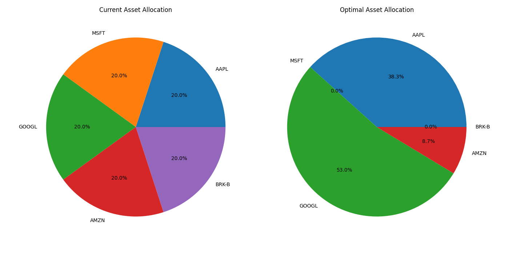

# 📊 PortOptima

A web application for portfolio analysis and optimization using Modern Portfolio Theory (MPT).

## 📋 Overview

PortOptima is a practical implementation of portfolio theory concepts that helps analyze investment portfolios and explore optimization possibilities. This tool demonstrates how MPT principles can be applied to evaluate portfolio performance, visualize risk-return relationships, and suggest potentially improved asset allocations.

## 🌐 Access the Application

**Website**: [tempdomain.com](https://tempdomain.com)

No installation required! Simply visit the website to start optimizing your investment portfolios.

## 🖼️ Sample Outputs

The PortOptima web application generates these visualizations to help you understand and optimize your investment portfolio:

### Asset Allocation Comparison

*Comparison between equal-weight allocation and optimized weights*

### Asset Correlation Matrix

*Correlation structure between assets in the portfolio*

### Efficient Frontier

*Risk-return tradeoff with randomly generated portfolios*

### Performance Metrics

*Key metrics for the analyzed portfolio*

## ✨ Features

- **Interactive Web Interface**: User-friendly application for portfolio analysis
- **Real-time Data**: Fetch historical price data for stocks using Yahoo Finance API
- **Portfolio Analysis**: Calculate key risk and return metrics
- **Portfolio Optimization**: Find portfolios with improved Sharpe ratio or reduced volatility
- **Visual Insights**: Interactive charts of efficient frontier, allocations, and metrics

## 💡 Using PortOptima

1. Navigate to [tempdomain.com](https://tempdomain.com)
2. Enter ticker symbols for the assets you want to analyze (e.g., AAPL, MSFT, GOOGL)
3. Configure optional parameters:
   - Custom asset weights
   - Historical data period (1y, 5y, etc.)
   - Risk-free rate
   - Optimization target (max Sharpe ratio, min volatility)
4. Generate your portfolio analysis
5. Explore the visualizations and optimization results

## ⚠️ Important Notes

- This is an educational tool that implements theoretical concepts
- Results should not be used as the sole basis for actual investment decisions
- Historical performance does not guarantee future results
- The optimization is based on historical data only and doesn't account for forward-looking views
- Transaction costs, taxes, and liquidity constraints are not considered

## 🔧 Technology Stack

- **Backend**: Django, Python
- **Data Analysis**: NumPy, Pandas, SciPy
- **Data Retrieval**: yfinance (Yahoo Finance API)
- **Visualization**: Matplotlib, Seaborn

## 📜 License

No license, do whatever you want with this.

---

*This tool was created as a learning project to explore portfolio theory concepts.* 🎓
